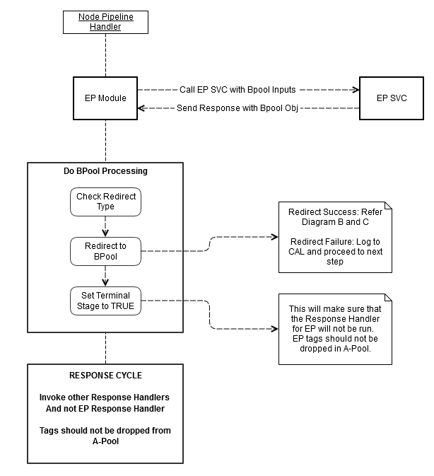

# experimentation-ebay
[](https://go/-/nodejsci/job/nodejs/job/experimentation-ebay/job/master/)   [](https://nodevalid-i3ey5.vip.lvs01.dev.ebayc3.com/nodejs/experimentation-ebay/)  [](http://sonar/dashboard/index?id=experimentation-ebay)


This module enables [eBay experimentation](https://wiki.vip.corp.ebay.com/pages/viewpage.action?pageId=263631935) for Node.js apps.

# This middleware is DEPRECATED
Starting Mar 2024 SWU, this middleware has been deprecated and replaced by [openfeature-ebay](https://github.corp.ebay.com/nodejs/openfeature-ebay)
Please ensure that code references with experimentation-ebay is cleaned up. You can refer to go/experimentation-ebay-deprecation.
1. Remove package dependency for @ebay/experimentation-ebay
2. Remove experimentation-ebay from middleware.json or config.json
3. Remove code references for req.ebay.experimentation

## Changelog

See   [CHANGELOG.MD](https://github.corp.ebay.com/nodejs/experimentation-ebay/blob/master/CHANGELOG.md#changelog)

# Installation

```bash
npm install experimentation-ebay
```

To register the middleware, the following code can be used

```javascript
app.use(require('@ebay/experimentation-ebay').middleware());
```

__NOTE:__
<br/>&nbsp;&nbsp;&nbsp;&nbsp;__1. In general, the Experimentation middleware will automatically be registered for your Node.js app__
<br/>&nbsp;&nbsp;&nbsp;&nbsp;__2. Expermentation module needs device-detection middleware to determine channel-id, if you are using experimentation please include device-detection middleware in middleware.json and ensure it has higer priority than the Experimentation middleware__


# Usage

## Request flow
Assuming the experimentation middleware has run for a request, then a new `req.ebay.experimentation` object will be made available. This object has methods that can be used to get access to the experimentation context associated with the request to get access to treatments, factors, etc. For example:

```javascript

// Provide some additional parameters to the experimentation service (optional):
req.ebay.experimentation.addParams({
    anyId: {
        idType: "CATEGORY",
        idValue: "iPad"
    }
});

req.ebay.experimentation.getContext(function(err, epContext) {
    if (epContext.hasTreatment('myTreatment')) {
        // The user has a treatment with name "myTreatment"
        ...
    }

    var treatmentsWithFactor = epContext.getTreatmentsWithFactor('someFactor');
    // Do something with the resulting array of treatments...
});
```

## Outside of request flow
```js
var Api = require('@ebay/experimentation-ebay/api');
var CHANNEL_ENUM = Api.CHANNEL_ENUM;
Api.getExperimentationContext({
    client: {
        siteId: 77,
        channelId: CHANNEL_ENUM.MOBILE_WEB
    },
    userIdentity: {
        guid: 'some guid',
        userId: 'user id';
    },
    sendQtags: true,
    optedInto: optedInto
}, function callback(err, epContext) {
    console.log(err, epContext);
});
```

## Default request parameters

Follwoing, are the default values sent in the EP service request when not overrriden using `req.ebay.experimentation.addParams` or [global paramters](#using-global-params)
```
{
    client: {
        siteId: ebay.getSiteId(),
        channelId: CHANNEL_ENUM.OTHER || getChannel(deviceInfo)
    },
    userIdentity: {
        guid: ebay.getGuid(),
        userId: ebay.getAccountId() || ebay.getBestUserId();
    },
    sendQtags: true,
    optedInto: optedInto,

    contextParams: {},
    filterCriteria: {}
}
```
## Middleware ordering
Make sure tracking middleware executes **before** experimentation middleware. If it does not, nqc, nqt, es and ec tags won't be dropped. These tags are strict requirement for Exprementation setup.
Example:  
  
```
    "tracking": {
        "enabled": true,
        "priority": 116,
        "module": {
            "name": "@ebay/tracking-ebay",
            "method": "middleware"
        }
    },
    
    "experimentation": {
        "enabled": true,
        "priority": 117,
        "module": "@ebay/experimentation-ebay/middleware"
    },
```

## Route based enable/disable

```
   {
        "path": "* /:id",
        "handler": "require:./src/pages/mypage",
        "pageName": "pagename",
        "ep": {
            "enabled": true
        }
    },
```
## Service invocation

Our default service invocation pipeline uses experimentation intstrument that can be configured as described [here](https://github.corp.ebay.com/nodejs/service-instruments-ebay#service-instruments-ebay)

Note: to turn off experience header that comes from the service you can use service config option:

```json
"services": {
   "my-service": {
      "ep": {
         "responseHeader": false, // <<< turn off EP header in response
         "type": "OPTIN_COOKIE"
      }
      ...
   }
}
```

# A/B Testing

The B-pool redirection functionality available in the experimentation platform allows experimenters to setup rules to redirect traffic to another pool that will serve the experience. Using this functionality experimenters can develop code for new experiences quicker without touching the existing infrastructure. Thus far, this functionality was available only in Raptor and V3 platforms but not in the Node platform. We have now enabled this functionality in the Experimentation Execution Service that is called by the Node Experimentation module and worked with the Node team to make the necessary Node client module changes as well.

Here is a diagram that explains how the B-pool redirection works in Node.


Key Benefits:
* Parity between Node experimentation module and Raptor V3 experimentation handlers.
* B-pool experimentation support in Node to enable building faster development for experiments without touching current infrastructure.

## Setting up experimentation in EP console (QA)

* Open go/epqa
* Create an experiment and submit
* Update b-pool settings and submit for approval

# Sample Code

## Simple Example

Using experimentation-ebay is as simple as this code:

```javascript
var template = require('marko').load(require.resolve('./template.marko'));


module.exports = function (req, res, next) {
    res.setHeader('Content-Type', 'text/html; charset=utf-8');

    var viewModel = {};

    req.ebay.experimentation.getContext(function (error, epContext) {
        if (error) {
            // Handle the case where the call to the experimentation service failed
            return next(error);
        }

        if (epContext.hasTreatment('treatment_nodeapp_1')) {
            ...
            //app logic for treatment 1
            ...
            viewModel.treatment = 'treatment1';
        } else if (epContext.hasTreatment('treatment_nodeapp_2') {
            ...
            //app logic for treatment 2
            ...
            viewModel.treatment = 'treatment2';
        } else {
            ...
            //app logic default behavior
            ...
            viewModel.treatment = 'noTreatment';
        }

        template.render(viewModel, res);
    });
};
```

## Using Global Params

`Global Params` may not be required for all the flows, If you have an usage to set Global Params, you can use config.json file.

Parameters specified in the config.json will be applied to every call to the experimentation service from the applicaiton however some or all global parameters can be overrriden at the call time using `addParams` method.

Create a `config.json` w.r.to the Application / Module, and create an entry for `experimentation-ebay` section in the config.

Following is the example for `@ebay/experimentation-ebay` config for Global params.

Example :

```JSON
"experimentation-ebay": {
    "genericParams": {

    },
    "contextualParams": {
        "OPT_OUT_LIST": 701361,
        "SELLER_SEGMENT_CSS_U": 1,
        "RESULTCOUNT": 1
    },
    "filterCriteria": {
        "treatmentPrefix": ["Tr", "a"],
        "treatmentNameRegexMatch": ".*Tr.*'"
    }
}

```

## ExperimentationContext

### getRawData()

Returns the raw data provided by the experimentation service

### getAllTreatments()

Returns an `Array` of all of the treatments.

### getTreatment(treatmentNameOrId)

Returns a treatment with the given name or ID (if any).

### hasTreatment(treatmentNameOrId)

Returns `true` if there is a treatment with the given name or ID. Otherwise, `false` is returned.

### getTreatmentsWithFactor(factorNameOrId)

Returns an `Array` of all of the treatments with the given factor name/ID.

### hasTreatmentsWithFactor(factorNameOrId)

Returns `true` if there are any treatments with the given factor name or ID. Otherwise, `false` is returned.

### getFactor(factorNameOrId)

Returns first matching factor with the given factor name/ID.

### hasFactor(factorNameOrId)

Returns `true` if there are matching factor with the given factor name/ID. Otherwise, `false` is returned.

### hasFactor(factorNameOrId)

Returns `true` if there are matching factor with the given factor name/ID. Otherwise, `false` is returned.

### getAnyIDTreatments()

Filters and Returns AnyID Treatments form all treatments.

### getClientSideExperiments()

Filters and Returns client side experiments used in runtime scripts from all treatments.

# Advanced

## Testing override (Dev, Stage only)

To enforce different treatment, you can override the FPTI guid by adding ?_guid=[guid] in the url.


# Sample

Sample request and response to the Experimentation service:

_REQUEST_:

```json
POST https://epsvc.vip.qa.ebay.com/epexesvc/ExperimentationExecutionService/v4/getQualifiedTreatments
Content-Type: application/json
{
   "client":{
      "siteId":0,
      "channelId":1
   },
   "userIdentity":{
      "guid":"0bb3578613f0a709b6900f79ffffde15"
   },
   "sendQtags":true,
   "contextParams":{
      "OPT_OUT_LIST":"701361",
      "SELLER_SEGMENT_CSS_U":"1",
      "RESULTCOUNT":"1"
   },
   "filterCriteria":{
      "experimentIds":[

      ],
      "treatmentPrefix":[

      ],
      "treatmentNameRegexMatch":"",
      "factorNameRegexMatch":"",
      "needFactorInfo":true,
      "needOptInInfo":true
   },
   "anyId": {
        "idType": "CATEGORY",
        "idValue": "iPad"
    }
}
```

_RESPONSE BODY_:

```json
{
   "logId":"es=0&ec=1&nqt=MAIAAAABAIACAQAAAAAAAAAAAAAAAAAAAAQAgASAAAAAAQAAAAAAAAACAAAAAAAAAAAAAAAAAAAAAAAAAAAAAAAAAAAAAAAAAAAAAAAAABAAQkUtAA4gAAB4gQAABAigCAAAAhQAAEAAAAQAAAAACEAAAAAAAAQAAAAAAAACAEAAIAAAAEgAABAIAAAAARAAAAAAAAAAAAAAAAUAAAAAACSFDJgEAAAAAAACAAAAAAE*&nqc=MAIAAAABAIACAQAAAAAAAAAAAAAAAAAAAAAAgASAAAAAAQAAAAAAAAAAAAAAAAAAAAAAAAAAAAAAAAAAAAAAAAAAAAAAAAAAAAAAAAAAAAAAQEEEAA4AAAAAAQAAAAAgAAAAAgQAAAAAAAQAAAAAAAAAAAAAAAQAAAAAAAAAAAAAIAAAAEgAAAAIAAAAABAAAAAAAAAAAAAAAAUAAAAAACCABIAAAAAAAAACAAAAAAE*",
   "treatments":[
      {
         "experimentId":703224,
         "experimentName":"testUGUIDconvergent for e2e automation dontmodify",
         "experimentType":7,
         "treatmentId":41758,
         "treatmentName":"asdfdsafdsafasf",
         "treatmentDisplayId":"ArW",
         "treatmentBitPosition":70,
         "clientSideEp": false
      },
      {
         "experimentId":702393,
         "experimentName":"do_not_modify_multi_site_test_007",
         "experimentType":1,
         "treatmentId":39691,
         "treatmentName":"tp_1_702393",
         "treatmentDisplayId":"AKB",
         "treatmentBitPosition":1100,
         "clientSideEp": false
      },
      {
         "experimentId":15,
         "experimentName":"Automation - Smoke Test - 03/06/2014 10:50:11",
         "experimentType":1,
         "treatmentId":18,
         "treatmentName":"Treatment_15",
         "treatmentDisplayId":"I",
         "treatmentBitPosition":2,
         "clientSideEp": false
      },
      {
         "experimentId":16,
         "experimentName":"Automation - Smoke Test - 03/06/2014 11:13:19",
         "experimentType":1,
         "treatmentId":19,
         "treatmentName":"Treatment_16",
         "treatmentDisplayId":"J",
         "treatmentBitPosition":3,
         "clientSideEp": false
      },
      {
         "experimentId":704694,
         "experimentName":"eBay Valet Hompage (VHP) and \"What's it Worth\" Page (WiW) (TPES-1476 / EPID-13853)",
         "experimentType":2,
         "treatmentId":45203,
         "treatmentName":"ValetHomePage",
         "factors":[
            {
               "id":147683,
               "name":"VHP",
               "value":"true"
            }
         ],
         "treatmentDisplayId":"Bl5",
         "treatmentBitPosition":232,
         "clientSideEp": false
      },
      {
         "experimentId":700627,
         "experimentName":"VI Raptor unsupported commands new",
         "experimentType":1,
         "treatmentId":36207,
         "treatmentName":"VI_RAPTOR_UNSUPPORTED_COMMANDS",
         "treatmentDisplayId":"9Pz",
         "treatmentBitPosition":727,
         "clientSideEp": false
      },
      {
         "experimentId":704271,
         "experimentName":"testAnyid",
         "experimentType":2,
         "treatmentId":44309,
         "treatmentName":"AnyIDTesting_trmt_704228_704228_704256_704271",
         "treatmentDisplayId":"BWf",
         "treatmentBitPosition":762,
         "clientSideEp": false
      },
      {
         "experimentId":703909,
         "experimentName":"Deals_35_US",
         "experimentType":2,
         "treatmentId":43344,
         "treatmentName":"DealsRedesign35",
         "treatmentDisplayId":"BH6",
         "treatmentBitPosition":649,
         "clientSideEp": false
      },
      {
         "experimentId":701758,
         "experimentName":"US - Guest Cart and Guest Checkout - Sep 2013",
         "experimentType":2,
         "treatmentId":38446,
         "treatmentName":"NEW_SESSION_MGMT_TREATMENT_CART_EP_TREATMENT_GUEST_CART_AND_GUEST_CHECKOUT",
         "factors":[
            {
               "id":142613,
               "name":"CMD_NAMES",
               "value":"shopcart.ShopCartGuestPermitted"
            },
            {
               "id":142614,
               "name":"POLICY_NAME",
               "value":"CartSession"
            },
            {
               "id":142615,
               "name":"showGXO",
               "value":"true"
            },
            {
               "id":142616,
               "name":"Reliability_Q3_Fixes",
               "value":"1"
            }
         ],
         "treatmentDisplayId":"A06",
         "treatmentBitPosition":47,
         "clientSideEp": false
      },
      {
         "experimentId":703543,
         "experimentName":"ctgredirectionfromshoptoraptor",
         "experimentType":1,
         "treatmentId":42534,
         "treatmentName":"FINDING_TREATMENT_113",
         "treatmentDisplayId":"B42",
         "treatmentBitPosition":853,
         "clientSideEp": false
      },
      {
         "experimentId":702587,
         "experimentName":"NEW_CIP_PAGE",
         "experimentType":2,
         "treatmentId":40281,
         "treatmentName":"CIP_COLLECTION_RAMP",
         "treatmentDisplayId":"ATh",
         "treatmentBitPosition":56,
         "clientSideEp": false
      },
      {
         "experimentId":704257,
         "experimentName":"InclExclPriorityTest",
         "experimentType":2,
         "treatmentId":44282,
         "treatmentName":"InclExclPriorityTest_trmt",
         "treatmentDisplayId":"BWE",
         "treatmentBitPosition":271,
         "clientSideEp": false
      },
      {
         "experimentId":704404,
         "experimentName":"PL on Desktop VI test",
         "experimentType":2,
         "treatmentId":44593,
         "treatmentName":"ATFVIPLMTTRMT",
         "factors":[
            {
               "id":145866,
               "name":"plmt-100010",
               "value":"[{\"numericId\":20131231133846},{\"numericId\":20150805074822},{\"numericId\":20150805074509},{\"numericId\":20131231084308,\"templateName\":\"VR_140PX_Template\",\"segment\":\"item!=null && item.active && !utils.isSellerOptedOut(-1,item.seller.id) && !item.isUnderMetaCategory(6028) && !item.isUnderMetaCategory(99) && !item.isUnderMetaCategory(267) && !item.isUnderMetaCategory(6001,6024,6038,26429,66466) && srchCtxt!=null && srchCtxt.query!=null && srchCtxt.query!='' && user!=null && !user.geo\",\"mixedRecommendations\":[{\"algos\":[\"PL.DEFAULT\"],\"minRecos\":1,\"maxRecos\":2},{\"algos\":[\"SIC.MBE.SimDiscoveryKeywordItem\",\"PW.MBE.InsPopUpdateTime\"],\"minRecos\":2,\"maxRecos\":22}]}]"
            }
         ],
         "treatmentDisplayId":"BbF",
         "treatmentBitPosition":1239,
         "clientSideEp": false
      },
      {
         "experimentId":704140,
         "experimentName":"Experience Service Test",
         "experimentType":2,
         "treatmentId":43973,
         "treatmentName":"EXP_REFERENCE_TREATMENT_TWO",
         "treatmentDisplayId":"BRF",
         "treatmentBitPosition":79,
         "clientSideEp": false
      },
      {
         "experimentId":701488,
         "experimentName":"PL on slot 4 & 5",
         "experimentType":2,
         "treatmentId":37835,
         "treatmentName":"OldMyWorldPageControl1",
         "factors":[
            {
               "id":146650,
               "name":"plmt-100010",
               "value":"{}"
            }
         ],
         "treatmentDisplayId":"9qF",
         "treatmentBitPosition":663,
         "clientSideEp": false
      },
      {
         "experimentId":703814,
         "experimentName":"SharedOrtho_Automation_Child_703814",
         "experimentType":2,
         "treatmentId":43113,
         "treatmentName":"SharedOrtho_parent_cntrl_703393_703814",
         "treatmentDisplayId":"BDN",
         "treatmentBitPosition":1068,
         "clientSideEp": false
      },
      {
         "experimentId":703813,
         "experimentName":"SharedOrtho_Automation_Parent_703813",
         "experimentType":2,
         "treatmentId":43111,
         "treatmentName":"SharedOrtho_parent_cntrl_703393_703813",
         "treatmentDisplayId":"BDL",
         "treatmentBitPosition":1065,
         "clientSideEp": false
      },
      {
         "experimentId":703393,
         "experimentName":"SharedOrtho_Automation_Parent",
         "experimentType":2,
         "treatmentId":42155,
         "treatmentName":"SharedOrtho_parent_cntrl_703393",
         "treatmentDisplayId":"Axv",
         "treatmentBitPosition":1407,
         "clientSideEp": false
      },
      {
         "experimentId":702193,
         "experimentName":"RTM SDC Decision Engine",
         "experimentType":1,
         "treatmentId":39280,
         "treatmentName":"SDC_Decision_Engine_Beta",
         "treatmentDisplayId":"ADY",
         "treatmentBitPosition":1034,
         "clientSideEp": false
      },
      {
         "experimentId":700575,
         "experimentName":"EVAutomation_Regular-DON\"T CHANGE",
         "experimentType":1,
         "treatmentId":36145,
         "treatmentName":"EVAutomationRegularT1",
         "treatmentDisplayId":"9Oz",
         "treatmentBitPosition":684,
         "clientSideEp": false
      },
      {
         "experimentId":704232,
         "experimentName":"AnyID- BotFilteringTesting_704232",
         "experimentType":2,
         "treatmentId":44210,
         "treatmentName":"AnyIDBotsTesting_cntrl_704232",
         "treatmentDisplayId":"BV4",
         "treatmentBitPosition":1237,
         "clientSideEp": false
      },
      {
         "experimentId":703555,
         "experimentName":"UGUID testExperiment sticky_703555",
         "experimentType":8,
         "treatmentId":42578,
         "treatmentName":"UGUIDtestExperiment_treatment1_702922_703555",
         "treatmentDisplayId":"B4k",
         "treatmentBitPosition":14,
         "clientSideEp": false
      },
      {
         "experimentId":700586,
         "experimentName":"PDSExprStringENDSWITH-DON'T CHANGE",
         "experimentType":1,
         "treatmentId":36156,
         "treatmentName":"PDSExprStringENDSWITHT1",
         "treatmentDisplayId":"9PA",
         "treatmentBitPosition":686,
         "clientSideEp": false
      },
      {
         "experimentId":700576,
         "experimentName":"EVAutomation_Ortho-DON'T CHANGE",
         "experimentType":2,
         "treatmentId":36146,
         "treatmentName":"EVAutomation_OrthoT1",
         "treatmentDisplayId":"9P0",
         "treatmentBitPosition":685,
         "clientSideEp": false
      },
      {
         "experimentId":700396,
         "experimentName":"Search Metrics Inline overlay survey for Automation",
         "experimentType":1,
         "treatmentId":35768,
         "treatmentName":"modularized overlay survey treatment",
         "factors":[
            {
               "id":68137,
               "name":"SURVEY_PARAMETER_4_ru_RU",
               "value":"SURVEY_NAME=RaptorInlineTest (RaptorInlineTest)&SURVEY_OVERLAY_TITLE_ru_RU=Param4_QEAuto-OverlayTitle:Расскажите подробнее(overlay survey)&YES_QUESTION_ru_RU=QEAuto-Overlay-YES-SURVEY_PARAMETER_4:да&NO_QUESTION_ru_RU=QEAuto-Overlay-YES-SURVEY_PARAMETER:нет"
            },
            {
               "id":68136,
               "name":"SURVEY_PARAMETER_4",
               "value":"SURVEY_NAME=RaptorInlineTest (RaptorInlineTest)&SURVEY_OVERLAY_TITLE=Param4_QEAuto-OverlayTitle:Tell us more(overlay survey)&YES_QUESTION=QEAuto-Overlay-YES-SURVEY_PARAMETER_4-Tell us more&NO_QUESTION=QEAuto-Overlay-NO-SURVEY_PARAMETER_4-Tell us more"
            }
         ],
         "treatmentDisplayId":"9Iu",
         "treatmentBitPosition":669,
         "clientSideEp": false
      },
      {
         "experimentId":703869,
         "experimentName":"SharedOrtho_test_Child",
         "experimentType":2,
         "treatmentId":43230,
         "treatmentName":"SharedOrtho_parent_cntrl_703393_703869",
         "treatmentDisplayId":"BFG",
         "treatmentBitPosition":949,
         "clientSideEp": false
      },
      {
         "experimentId":702496,
         "experimentName":"Automation Regression-DON'T CHANGE_702496",
         "experimentType":1,
         "treatmentId":40022,
         "treatmentName":"PDSExprStringENDSWITHT1_702496",
         "treatmentDisplayId":"APW",
         "treatmentBitPosition":1139,
         "clientSideEp": false
      },
      {
         "experimentId":704597,
         "experimentName":"test anyidtool guid ortho",
         "experimentType":2,
         "treatmentId":45013,
         "treatmentName":"treatmenanyidtoolguidortho",
         "treatmentDisplayId":"Bi1",
         "treatmentBitPosition":805,
         "clientSideEp": false
      },
      {
         "experimentId":700834,
         "experimentName":"channel_01_test",
         "experimentType":1,
         "treatmentId":36555,
         "treatmentName":"channel_01_testt1",
         "treatmentDisplayId":"9Vb",
         "treatmentBitPosition":657,
         "clientSideEp": false
      },
      {
         "experimentId":702987,
         "experimentName":"SRP Raptor Unsupported commands_700647_702987",
         "experimentType":2,
         "treatmentId":41215,
         "treatmentName":"SRP_Raptor_Unsup_Cmds_700647_702987",
         "treatmentDisplayId":"Ail",
         "treatmentBitPosition":1366,
         "clientSideEp": false
      },
      {
         "experimentId":704287,
         "experimentName":"AnyID- MutliSiteMultiChannelTesting",
         "experimentType":9,
         "treatmentId":44348,
         "treatmentName":"AnyIDMultiSiteChannelTesting_cntrl",
         "treatmentDisplayId":"BXI",
         "treatmentBitPosition":229,
         "clientSideEp": false
      },
      {
         "experimentId":704300,
         "experimentName":"AnyID: InclPriorityTest",
         "experimentType":9,
         "treatmentId":44379,
         "treatmentName":"InclPriorityTest4T1_704300",
         "treatmentDisplayId":"BXn",
         "treatmentBitPosition":1282,
         "clientSideEp": false
      },
      {
         "experimentId":704595,
         "experimentName":"test sanity anyid nirmala DTS",
         "experimentType":9,
         "treatmentId":45010,
         "treatmentName":"controlnirmala",
         "treatmentDisplayId":"Bhy",
         "treatmentBitPosition":798,
         "clientSideEp": false
      },
      {
         "experimentId":704652,
         "experimentName":"AnyID- MutliSiteMultiChannelTesting_Automation",
         "experimentType":9,
         "treatmentId":45117,
         "treatmentName":"AnyIDMultiSiteChannelTesting_trmt_704652",
         "treatmentDisplayId":"Bjh",
         "treatmentBitPosition":216,
         "clientSideEp": false
      },
      {
         "experimentId":704303,
         "experimentName":"AnyID-InclPriorityTest2",
         "experimentType":9,
         "treatmentId":44386,
         "treatmentName":"AnyID-InclPriorityTest2-cntrl",
         "treatmentDisplayId":"BXu",
         "treatmentBitPosition":1288,
         "clientSideEp": false
      },
      {
         "experimentId":704311,
         "experimentName":"AnyID-SOJTagtest",
         "experimentType":9,
         "treatmentId":44399,
         "treatmentName":"AnyID-SOJTagtest-trmt",
         "treatmentDisplayId":"BY7",
         "treatmentBitPosition":1304,
         "clientSideEp": false
      },
      {
         "experimentId":704307,
         "experimentName":"AnyID-InclPriorityTest4",
         "experimentType":9,
         "treatmentId":44393,
         "treatmentName":"AnyID-InclPriorityTest2-trmt_704307",
         "treatmentDisplayId":"BY1",
         "treatmentBitPosition":1301,
         "clientSideEp": true
      }
   ],
   "qTags":[
      {
         "key":"es",
         "value":"0",
         "type":"SCALAR"
      },
      {
         "key":"nqc",
         "value":"MAIAAAABAIACAQAAAAAAAAAAAAAAAAAAAAAAgASAAAAAAQAAAAAAAAAAAAAAAAAAAAAAAAAAAAAAAAAAAAAAAAAAAAAAAAAAAAAAAAAAAAAAQEEEAA4AAAAAAQAAAAAgAAAAAgQAAAAAAAQAAAAAAAAAAAAAAAQAAAAAAAAAAAAAIAAAAEgAAAAIAAAAABAAAAAAAAAAAAAAAAUAAAAAACCABIAAAAAAAAACAAAAAAE*",
         "type":"SCALAR"
      },
      {
         "key":"nqt",
         "value":"MAIAAAABAIACAQAAAAAAAAAAAAAAAAAAAAQAgASAAAAAAQAAAAAAAAACAAAAAAAAAAAAAAAAAAAAAAAAAAAAAAAAAAAAAAAAAAAAAAAAABAAQkUtAA4gAAB4gQAABAigCAAAAhQAAEAAAAQAAAAACEAAAAAAAAQAAAAAAAACAEAAIAAAAEgAABAIAAAAARAAAAAAAAAAAAAAAAUAAAAAACSFDJgEAAAAAAACAAAAAAE*",
         "type":"SCALAR"
      },
      {
         "key":"qt",
         "value":"42534,39691,44593,43230,19,18,44309,37835,35768,39280,43344,40022,42155,41758,43973,44282,38446,44210,36207,36145,45203,42578,36555,36146,43113,41215,43111,36156,45013,40281,42803,36174,45158,36587,44440,36183,36182,44443,45178,44711,36189,44860,36185,36184,37420,36802,44449,44550,41323,44491,38663,38550,36148,36151,36153,36152,44412,44386,45117,44399,45010,44397,44392,44379,44393,44348,44389,45161,44387,44858",
         "type":"VECTOR"
      },
      {
         "key":"ec",
         "value":"1",
         "type":"SCALAR"
      },
      {
         "key":"qc",
         "value":"590081,590081,590081,590081,590081,590081,590081,590081,590081,590081,590081,590081,590081,590081,590081,590081,590081,590081,590081,590081,590081,590081,590081,590081,590081,590081,590081,590081,590081,590081,917761,590849,655617,925728,917764,598017,598017,917764,917792,917761,655617,655617,598017,598017,917761,655617,598017,917792,655617,917792,655617,598017,917761,917761,917764,917761,598017,590081,590081,590081,590081,655360,655360,590081,590081,590081,655360,925697,925728,655360",
         "type":"VECTOR"
      }
   ],
   "rLogId":"t6fuuq%60%28ciuc1mlnm2%3Asn%3D9%60vtuf%2B4217-15310201196-0x9c",
   "ack":"SUCCESS",
   "epQualificationResult":"ql=42534%7C590081%7CG%3B39691%7C590081%7CG%3B44593%7C590081%7CG%3B43230%7C590081%7CG%3B19%7C590081%7CG%3B18%7C590081%7CG%3B44309%7C590081%7CG%3B37835%7C590081%7CG%3B35768%7C590081%7CG%3B39280%7C590081%7CG%3B43344%7C590081%7CG%3B40022%7C590081%7CG%3B42155%7C590081%7CG%3B41758%7C590081%7CG%3B43973%7C590081%7CG%3B44282%7C590081%7CG%3B38446%7C590081%7CG%3B44210%7C590081%7CG%3B36207%7C590081%7CG%3B36145%7C590081%7CG%3B45203%7C590081%7CG%3B42578%7C590081%7CG%3B36555%7C590081%7CG%3B36146%7C590081%7CG%3B43113%7C590081%7CG%3B41215%7C590081%7CG%3B43111%7C590081%7CG%3B36156%7C590081%7CG%3B45013%7C590081%7CG%3B40281%7C590081%7CG%3B,nql=42803%7C655617%7CG%3B36174%7C590849%7CG%3B45158%7C655617%7CG%3B36587%7C663584%7CG%3B44440%7C655620%7CG%3B44443%7C655620%7CG%3B45178%7C655648%7CG%3B44711%7C655617%7CG%3B36189%7C655617%7CG%3B44860%7C655617%7CG%3B37420%7C655617%7CG%3B36802%7C655617%7CG%3B44550%7C655648%7CG%3B41323%7C655617%7CG%3B44491%7C655648%7CG%3B38663%7C655617%7CG%3B36148%7C655617%7CG%3B36151%7C655617%7CG%3B36153%7C655620%7CG%3B36152%7C655617%7CG%3B,nil=36183%7C598017%7CG%3B36182%7C598017%7CG%3B36185%7C598017%7CG%3B36184%7C598017%7CG%3B44449%7C598017%7CG%3B38550%7C598017%7CG%3B44412%7C598017%7CG%3B,anyid=44386%7C590081%7CA%3B45117%7C590081%7CA%3B44399%7C590081%7CA%3B45010%7C590081%7CA%3B44397%7C655360%7CA%3B44392%7C655360%7CA%3B44379%7C590081%7CA%3B44393%7C590081%7CA%3B44348%7C590081%7CA%3B44389%7C655360%7CA%3B45161%7C925697%7CA%3B44387%7C925728%7CA%3B44858%7C655360%7CA%3B,pdseval=true,c=1,v=v2"
}
```

Calling getTreatment('ValetHomePage') on context object created from above response

```json
{
    "experimentId":704694,
    "experimentName":"eBay Valet Hompage (VHP) and \"What's it Worth\" Page (WiW) (TPES-1476 / EPID-13853)",
    "experimentType":2,
    "treatmentId":45203,
    "treatmentName":"ValetHomePage",
    "factors":[
    {
        "id":147683,
        "name":"VHP",
        "value":"true"
    }
    ],
    "treatmentDisplayId":"Bl5",
    "treatmentBitPosition":232
}
```

 Calling getFactor('SURVEY_PARAMETER_4_ru_RU') on context object created from above response will return

```json
{
    "id":68137,
    "name":"SURVEY_PARAMETER_4_ru_RU",
    "value":"SURVEY_NAME=RaptorInlineTest (RaptorInlineTest)&SURVEY_OVERLAY_TITLE_ru_RU=Param4_QEAuto-OverlayTitle:Расскажите подробнее(overlay survey)&YES_QUESTION_ru_RU=QEAuto-Overlay-YES-SURVEY_PARAMETER_4:да&NO_QUESTION_ru_RU=QEAuto-Overlay-YES-SURVEY_PARAMETER:нет"
}
```
Calling getClientSideExperiments() on context object created from above response

```json
{
   "clientSideEps": [ 
      {
         "experimentId":704307,
         "experimentName":"AnyID-InclPriorityTest4",
         "experimentType":9,
         "treatmentId":44393,
         "treatmentName":"AnyID-InclPriorityTest2-trmt_704307",
         "treatmentDisplayId":"BY1",
         "treatmentBitPosition":1301,
         "clientSideEp": true
      }
   ],
   "qTags": [
      {
         "key":"es",
         "value":"0",
         "type":"SCALAR"
      },
      {
         "key":"nqc",
         "value":"MAIAAAABAIACAQAAAAAAAAAAAAAAAAAAAAAAgASAAAAAAQAAAAAAAAAAAAAAAAAAAAAAAAAAAAAAAAAAAAAAAAAAAAAAAAAAAAAAAAAAAAAAQEEEAA4AAAAAAQAAAAAgAAAAAgQAAAAAAAQAAAAAAAAAAAAAAAQAAAAAAAAAAAAAIAAAAEgAAAAIAAAAABAAAAAAAAAAAAAAAAUAAAAAACCABIAAAAAAAAACAAAAAAE*",
         "type":"SCALAR"
      },
      {
         "key":"nqt",
         "value":"MAIAAAABAIACAQAAAAAAAAAAAAAAAAAAAAQAgASAAAAAAQAAAAAAAAACAAAAAAAAAAAAAAAAAAAAAAAAAAAAAAAAAAAAAAAAAAAAAAAAABAAQkUtAA4gAAB4gQAABAigCAAAAhQAAEAAAAQAAAAACEAAAAAAAAQAAAAAAAACAEAAIAAAAEgAABAIAAAAARAAAAAAAAAAAAAAAAUAAAAAACSFDJgEAAAAAAACAAAAAAE*",
         "type":"SCALAR"
      },
      {
         "key":"qt",
         "value":"42534,39691,44593,43230,19,18,44309,37835,35768,39280,43344,40022,42155,41758,43973,44282,38446,44210,36207,36145,45203,42578,36555,36146,43113,41215,43111,36156,45013,40281,42803,36174,45158,36587,44440,36183,36182,44443,45178,44711,36189,44860,36185,36184,37420,36802,44449,44550,41323,44491,38663,38550,36148,36151,36153,36152,44412,44386,45117,44399,45010,44397,44392,44379,44393,44348,44389,45161,44387,44858",
         "type":"VECTOR"
      },
      {
         "key":"ec",
         "value":"1",
         "type":"SCALAR"
      },
      {
         "key":"qc",
         "value":"590081,590081,590081,590081,590081,590081,590081,590081,590081,590081,590081,590081,590081,590081,590081,590081,590081,590081,590081,590081,590081,590081,590081,590081,590081,590081,590081,590081,590081,590081,917761,590849,655617,925728,917764,598017,598017,917764,917792,917761,655617,655617,598017,598017,917761,655617,598017,917792,655617,917792,655617,598017,917761,917761,917764,917761,598017,590081,590081,590081,590081,655360,655360,590081,590081,590081,655360,925697,925728,655360",
         "type":"VECTOR"
      }
   ]
```

# Common Code for Client Side EP
`utils.js` under folder `browser/` includes some common code for client side experiments. There are three exposed methods: `waitForElement`, `runExperiments` and `getTagValue`. 

`waitForElement` can detect dom elements change and `getTagValue` can parse the value from client side ep tags.

To enable client side ep and drop xt tags, customers need to call `runExperiments` method. In this method, customers should construct an experiment map as parameter like the following, key is the factor key in experiments, and value is a list of objects which has a qualifier and a handler. The reason why the value should be a list is that, if not a list, when an experiment has multiple treatments with the same factor, render handlers would be overrided and it's hard to know which one will be used. Qualifier is the factor value, while handler is the method to render different effects. 

```
export const experiments = {
  EXPOSE_SEARCH_BAR: [{ qualifier: 'true', handler: exposedSearchBar }],
  hg_color_green: [{qualifier: '1', handler: changeBgColorToRed}, {qualifier: '2', handler: changeBgColorToGreen}]
}
```

Here is an example of handler in experiments:

```
export const changeBackgroundColor = (siteId) => {
    const style = document.createElement('style');
    style.innerHTML = "div.vi-title__main{background-color:green}";

    const script = document.createElement('script');
    script.innerHTML = "''";

    if (siteId == 0) {
        script.innerHTML = "Hello US!";
    } else if (siteId == 3) {
        script.innerHTML = "Hi UK!";
    }

    document.body.appendChild(style);
    document.body.appendChild(script);
}
```
SiteId is the eBay site users are visiting. If an experiment is enabled in multiple sites, developers should handle all possible cases in their handlers like the above if-else condition.

An example of #clientSideExperiments element in `runExperiments` method: 

```
<input type="hidden" value="{"qTags":[{"key":"nqt","value":"AAAAAAAAAAAAAAAAAAAAAAAAAAAAAAAAAAAAAAAAAQAAAAAAAAAAAAAAAAAAAAAAAAAgAAAAAAAAAAAQAAAAAAAAAAAAAIAAAAAAAAAgAAAAAEALAAwgCAAYAAAABAiACAABABAAAAICAAAAAAAIBAAAAAAAAAAAAAAAAAAAAAAABCAAAAAAAAAAAAAAAAAAAEAAgAAAAAAAEAAAAAAgEACAAKQIAAAAAAAACBBBAAAgAAAAAAAAAAAAAAAAAAAAAABAACAAAAAAQAAAAAQgQQBAEBAJAEgAAAAAAMAAUAAAAAgAAAAAQAAAAAAACwCRCAQFAAgIAg**","type":"SCALAR"},{"key":"nqc","value":"AAAAAAAAAAAAAAAAAAAAAAAAAAAAAAAAAAAAAAAAAQAAAAAAAAAAAAAAAAAAAAAAAAAgAAAAAAAAAAAQAAAAAAAAAAAAAIAAAAAAAAAAAAAAAEAAAAwACAAAAAAAAAgAAAABAAAAAAICAAAAAAAABAAAAAAAAAAAAAAAAAAAAAAAACAAAAAAAAAAAAAAAAAAAEAAAAAAAAAAAAAAAAAgEACAAKQIAAAAAAAACBBAAAAgAAAAAAAAAAAAAAAAAAAAAABAACAAAAAAQAAAAAQAAABAEAAJAEgAAAAAAMAAUAAAAAgAAAAAQAAAAAAACwCRCAAFAAgIAg**","type":"SCALAR"},{"key":"qc","value":"590080,590080,590080,590080,590080,590080,590080,590080,590080,721152,590080,590080,590080,590080,590080,590080,590080,590080,590080,590080,590080,590080,590080,590080,590080,590080,721152,590080,590080,590080,721152,590080,590080,721152,590080,590080,590080,590080,590080,590080,590080,590080,590080,590080,590080,590080,590080,721152,590080,590080,590080,590080,590080,590080,655616,655616,598016,655616,655616,655616,655616,655616,655616,655616,655616,655616,655616,655616,598016,598016,655616,598016,598016,655616,663552","type":"VECTOR"},{"key":"mdbreftime","value":"1651926395097","type":"SCALAR"},{"key":"qt","value":"54402,122883,126213,126085,125829,126087,124425,122893,122257,117009,122256,122646,55450,122653,126111,125855,126113,42155,126636,122668,126638,122161,36145,36146,126643,126131,36151,125248,126656,126659,123074,125766,126662,125640,36555,125009,126547,40022,126550,126553,125791,116574,126689,44386,125283,121315,126564,45159,125931,125804,44399,126581,126331,122623,44550,38663,125082,126620,125483,125611,125482,125488,36148,36152,36153,45374,121918,36802,116933,36174,121811,36184,36185,125674,36587","type":"VECTOR"},{"key":"es","value":"0","type":"SCALAR"},{"key":"ec","value":"1","type":"SCALAR"}],"clientSideEps":[{"treatmentId":124425}],"siteId":"US"}" data-pageci="0bc37c3b-b2f5-4a68-a7e6-27aacbf72f51" data-operationid="2349624" id="clientSideExperiments">
```

# Sample code to drop experimentation tags from node app of node app is powered by the experience service
_NOTE_: By default, node app will not drop any of the tracking tags including experimentation tags from the node layer if it is powered by the experience service to avoid duplicate tracking events

If there is a need to drop experimentation tags from the node app then here is the sample code as a work around
```javascript
const SojournerEventEnum = require(`@ebay/tracking-ebay`).SojournerEventEnum
const tracking = req.ebay && req.ebay.tracking
const eventTracker = tracking && tracking.getPulsarEventTracker()
const sojournerContext = tracking && tracking.sojournerContext

const experimentation = req.ebay && req.ebay.experimentation
const epContext = experimentation.getContext()
const rawData = epContext?.getRawData?.() || {}
const { qTags = [] } = rawData
const { ec, es, nqc, nqt, ot } = qTags

if (tracking && eventTracker && sojournerContext) {
   eventTracker.setEventType(`TAGXT`, `EXPRMT`, `1.0`)
   eventTracker.addData(`p`, tracking.pageId)
   eventTracker.addData(`ec`, ec)
   eventTracker.addData(`es`, es)
   eventTracker.addData(`nqc`, nqc)
   eventTracker.addData(`nqt`, nqt)
   eventTracker.addData(`ot`, ot)
   eventTracker.addData(`xt`, treatmentId)
   const eventDataMap = sojournerContext.getAppDataMapByEvent(SojournerEventEnum.APPLICATION) || {}
   
   Object.entries(eventDataMap).forEach(([key, value]) => {
      const isVector = typeof value === `object` && typeof value.appendData === `function`
      const eventKey = isVector ? value.getSafeTagName(key) : key
      const eventValue = isVector ? value.toString() : value
      eventTracker.addData(eventKey, eventValue)
    })

   eventTracker.flush()

   //Since experimentation tags are dropped using as custom event to tracking using eventTracker, experimentation
   //related tags are removed from the sojournerContext which is request scope tracking context
   sojournerContext.deleteData(SojournerEventEnum.APPLICATION, `xt`)
   sojournerContext.deleteData(SojournerEventEnum.APPLICATION, `!xt`)
}
```javascript
