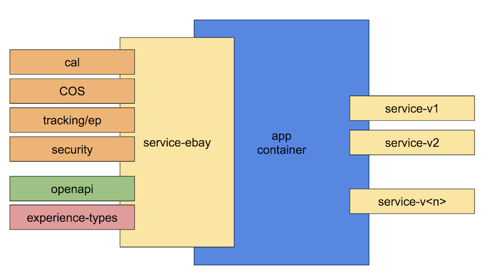

# service-ebay

[](https://go/-/nodejsci/job/nodejs/job/service-ebay/job/master/)
[](https://nodevalid-i3ey5.vip.lvs01.dev.ebayc3.com/nodejs/service-ebay)  [](http://sonar/dashboard/index?id=service-ebay)

Node.js COS/EST Service bootstrapping for eBay infrastructure.

## Usage

service-ebay works much like `kraken` or `brogan` and serves as an eBay infrasturture adaptor for nodejs service applications with some additional middleware required by COS services standard.

```javascript
const service = require('@ebay/service-ebay');
const app = await service();
app.listen(8082);
app.listen(8080);
```

service-ebay supports the same `options` that `kraken` and `@ebay/brogan-ebay` modules support.

```javascript
const service = require('@ebay/service-ebay');
const app = await service({
    onconfig: configs => {
        // here you can read configs for your needs or even change them if you really need that.
        // the configs correspond to each app hosted by this container.
        // In most cases, it will be a single config in the array.
        return configs;
    }
});
app.listen(8082);
```

This will configure and start a service application.

### Features
 * COS/EST compliant (some standards implementation are in progress, see bottom of the page for status)
 * OpenAPI 3.0 constract
    * eBay service descriptor generation out of openapi schema.
 * Generation of service stub code
    * Tests are automatically generated based on OpenAPI contract, so that you have full code coverage right at the start.
 * Version support
    * Multi-version support per VM, if you choose.
    * Single version, if you want to follow single version model per VM.
 * Automatic documentation generation and hosting by the service (you can even execute commands)
 * Configuration (local, raptor config)
 * OAuth security
 * Monitoring (SRE, MCF)
 * Logging (CAL, logging)
 * Tracking

### Quick Start Guide

Use `@ebay/generator-service-ebay` to create a sample Node.js service at eBay.

#### 1. Stub Service

Install `yo` and `@ebay/generator-service-ebay`.

```bash
$ npm install -g yo
$ npm install -g generator-service-ebay
$ yo service-ebay
```

Follow the instructions:

- Choose a name (petstore in this example).
- Enter github/email details.
- Enter consumer id.
- Provide location or url to openapi contract for your API. For example, you use the following URL as a sample: https://raw.githubusercontent.com/OAI/OpenAPI-Specification/master/examples/v3.0/petstore.yaml

You will now have a working ebay express/openapi host server and service app module.
<root>/app - application module
<root>/app/tests - application module tests
<root>/server - hosting app

#### 2. Run server
```bash
cd ./server
node .
```

#### 3. Test

Test by making requests against the API paths. It may require a [security context](https://github.corp.ebay.com/commerceos/cos-secure-access/blob/master/secure-access.md) header.

API: http://localhost:8080/{app/openapi.yaml/baseHost}

Openapi spec: http://localhost:8080/{app/openapi.yaml/baseHost}/api-docs

----

### Service architecture



* The service modules (service-v{version}) are hosted on Host app.
* service-ebay provides bootstrapping with default configuration and set of middlewares
* [service-errors-ebay](https://github.corp.ebay.com/nodejs/service-errors-ebay) provides error handling and formatting per COS spec.
* [service-security-ebay](https://github.corp.ebay.com/nodejs/service-security-ebay) provides OAuth2 security per COS spec.
* [openapi-ebay](https://github.corp.ebay.com/nodejs/openapi-ebay) is generic module that adapts express to openapi.

The slides can be found [here](https://github.corp.ebay.com/nodejs/nodejs-presentations/blob/master/nodejs-services-ebay.pptx?raw=true)

### Service application life cycle, nodejs specifics.
Full life cycle spec can be found [here](https://github.corp.ebay.com/commerceos/cos-service-lifecycle/blob/master/cos-service-lifecycle.md)

1. Provision your service application instance in Altus (including CI). Currently only [QA Altus](http://altus-qa-02.stratus.dev.ebay.com) support nodejs services.
2. Define your RESTful API using local [openapi](http://go/swagger) or public [version](http://editor.swagger.io/).
    * Openapi [specification](https://swagger.io/specification/).
    * Make sure your openapi server url has a basePath attribute in COS format, i.e. <appname>/<version number>
    ```yaml
    openapi: 3.0.0
    info:
    version: 1.0.0
    title: Search Sample Service
    description: >-
        This is a sample nodejs service application
    termsOfService: 'http://api.ebay.com'
    contact:
        email: DL-eBay-NodeJS-Platform@ebay.com
        url: 'https://pages.github.corp.ebay.com/nodejs/eBayNodeJs/'
    servers:
    - url: 'http://petstore.swagger.io/svc/v2'
    ```

    * Your service must be secured. You can compy the scopes required by your application

    Yaml format:

```yaml
  securitySchemes:
    app_scope_auth:
      type: oauth2
      description: >-
        The security definitions for this API. Please check individual
        operations for applicable scopes.
      flows:
        clientCredentials:
          tokenUrl: 'https://api.ebay.com/identity/v1/oauth2/token'
          scopes:
            'https://api.ebay.com/oauth/scope/@public': This scope would allow anonymous access to public Commerce OS API and is largely meant to be used when the token needs to be used from a public environment (JavaScript widget / anonymous access from devices)
            'https://api.ebay.com/oauth/scope/buy@user': "This scope would allow signed in user access to both public and private content for the signed in user through appropriate Commerce OS API. Since the tokens associated with these scopes are to be used specifically on behalf of a single user, they may be used from any environment."
            'https://api.ebay.com/oauth/scope/buy@application': "This scope would allow first-party applications to access any API associated with a buy intent. The privileged access means that bearers of tokens with this scope will be able to invoke any API with the buy intent, including and not limited to API that allows them to perform operations on behalf of any user. Tokens with this scope should be restricted to the eBay server environments."
            'https://api.ebay.com/oauth/scope/social@user': This scope would applications to access any API associated with a social intent on behalf of a signed in user.
            'https://api.ebay.com/oauth/scope/social@application': This scope would applications to access any API associated with a social intent.
            'https://api.ebay.com/oauth/scope/sell@user': "This scope would allow signed in user access to both public and private content for the signed in user through sell or merchant intended Commerce OS API. Since the tokens associated with these scopes are to be used specifically on behalf of a single user, they may be used from any environment."
            'https://api.ebay.com/oauth/scope/sell@application': "This scope would allow first-party applications to access any API associated with a sell / merchant intent. The privileged access means that bearers of tokens with this scope will be able to invoke any API with the associated intents, including and not limited to API that allows them to perform operations on behalf of any user. Tokens with this scope should be restricted to the eBay server environments."
            'https://api.ebay.com/oauth/scope/marketing@user': This scope would allow applications to access API associated with a marketing intent.
            'https://api.ebay.com/oauth/scope/marketing@application': This scope would allow applications to access any API associated with a marketing intent. Tokens with this scope should be restricted to use from server environments.
            'https://api.ebay.com/oauth/scope/customerservice@application': This scope would allow applications to access any API associated with a customerservice intent. Tokens with this scope should be restricted to use from server environments.
            'https://api.ebay.com/oauth/scope/analytics@application': This scope would allow applications to access any API associated with a analytics intent. Tokens with this scope should be restricted to use from server environments.
            'https://api.ebay.com/oauth/scope/merchant@user': This scope would allow applications to access any API associated with a core intent. Tokens with this scope should be restricted to use from server environments.
            'https://api.ebay.com/oauth/scope/merchant@application': This scope would allow applications to access any API associated with a merchant intent. Tokens with this scope should be restricted to use from server environments.
            'https://api.ebay.com/oauth/scope/experience@user': This scope would allow applications to access any API associated with experience services. Tokens with this scope should be restricted to use from server and device environments.
            'https://api.ebay.com/oauth/scope/core@user': This scope would signed in users to access any API associated with a core intent. Tokens with this scope should be restricted to use from server environments.
            'https://api.ebay.com/oauth/scope/core@application': This scope would allow applications to access any API associated with a core intent. Tokens with this scope should be restricted to use from server environments.
            'https://api.ebay.com/oauth/scope/base@user': This scope would allow signed in user to access any API associated with a base intent. Tokens with this scope should be restricted to use from server environments.
            'https://api.ebay.com/oauth/scope/base@application': This scope would allow applications to access any API associated with a base intent. Tokens with this scope should be restricted to use from server environments.
            'https://api.ebay.com/oauth/scope/base@public': "This scope would allow authorized applications to access certain API associated with a base intent. Tokens with this scope should be restricted to 1st and 2nd Party applications leveraging infrastructure services such as location, tracking, experimentation, etc."
            'https://api.ebay.com/oauth/scope/experience@public': This scope would allow applications to access any public API associated with experience services.
```
    * And assign security scopes to routes that need it. Route example:

```yaml
  '/pets/{id}':
    get:
      description: >-
        Returns a user based on a single ID, if the user does not have access to
        the pet
      operationId: find pet by id
      security: 
        - app_scope_auth:
          - 'https://api.ebay.com/oauth/scope/core@application'
```
3. Download openapi.yaml contract to your drive.
4. Use a [start application](https://github.corp.ebay.com/nodejs/nodejssampleservice) or generate initial application service using youman [generator](https://github.corp.ebay.com/nodejs/generator-service-ebay)
    ```bash
    yo service-ebay
    ```
    Node: Provide consumer id from your Altus provisioning.
    This will generate two folders app and server folders or a single app is you choose a single vertion.
    * app  is a service application that can be published to ebay npm.
    * server is a hosting application that should be deployed to the pool via altus.

5. Switch to server directory, install and run your app
    ```bash
    yarn
    node .
    ```
    * Documentation API: http://localhost:8080/your-appname/v1
    * Schema: http://localhost:8080/your-appname/v1/api-docs
6. Register your application in [Fulcrum](https://www.fulcrum.stratus.ebay.com) by importing from AR (Application->Import AR)
    * Add yourself into contacts.
    * Set application type.
7. Publish app module.
    * When you just started, you can keep server and app together in one git and build/deploy as one application.
    * Once it is time to add new version of the application you need to start publishing it to npm.
        * Master branch always has a latest version (you can also extract app module folder into a separate project in git)
        * The module name should always be {appname}-v{version number}. Example: prp-v2
        * You need to delete postinstall script in server/package.json/scripts and add application module as a dependency to server/package.json.
        ```json
        {
            "appname-v1": "^1.0"
        }
        ```
        * The module lifecycle:
            * Before you publish new version of the module (major version), please make sure if this is the first time, you publish previous version of the module.
            * Incompatible changes (existing API needs to change). This should be a rare use-case.
                * Create a branch for exiting version that will be used for bug fixing and publishing patches.
                * [Master branch] Update module name to {appname}-v{version+1}. This will become application latest version
                * [Master branch] Make sure swagger.json has updated basePath: {appname}/v{version+1}
                * [Master branch] Make necessary changes to the module code and publish it.
                * [Server app] Add new version of the module to server/config/config.json. Example:
                ```json
                {
                    "applications": [
                        {
                            "name": "appname-v1",
                            "module": "appname-v1"
                        },
                        {
                            "name": "appname-v2",
                            "module": "appname-v2"
                        }
                    ]
                }
                ```
                * [Server app] Add newly published module to server/package.json
                ```json
                {
                    "appname-v1": "^1.0",
                    "appname-v2": "^2.0"
                }
                ```
            * Compatible changes
                * [Master branch] Increment your app module version and push it
                ```bash
                $ npm version patch
                $ git push --follow-tags
                $ npm publish
                ```
                * It will be automatically picked up by server app during next CI build.
8. CI Build.
    * This should build server app that can be deployed to the pool via Altus.
    * Since the folder structure is different from default, make sure you cd to server folder before npm install.
9. Deployment
    * Currently, due to restriction to Altus QA you can only deploy via [cmpaas](http://cmpaas.vip.ebay.com)
10. File a [capacity ticket](https://wiki.vip.corp.ebay.com/display/APPLICATIONSECURITY/Capacity+analysis) for your app.
    * Notify IAF team (DL-eBay-PD-IAF) about your capacity ticket so that they can add capacity to the authentication service if needed.
11. Rate limiting is shared between web and service flow and can be done [similar](https://github.corp.ebay.com/nodejs/ratelimiter-ebay) to web flow where pageName will be set with operationId. The only difference is you need to provide custom handler to produce correct json response with rate limit error.

### Decoupling via context

The module allows to abstract from express method siganture "(req, res, next) => {}" towards more generic pattern that is easy to separate business logic into, unit test and compose more complex actions.

Example of a context based function:
```js
context => (param1, param2, etc.) => {
    // function logic
};

# or 

context => {
    const { param1, param2, etc. } = context;
    // function logic
    ...
};
```
#### Configuration

The functions can be made available in the context instance that is passed to every action/function via runtime-context configuration property.

app/config.json:

```json
{
    "services": {
        "historyService": {},
        "wishListService": {},
    },
    "runtime-context": {
        "actions": {
            "getUserData": "path:src/actions/get-user-data",
            "updateUserData": "path:src/actions/update-user-data"
        },
        "sales": {
            "purchaseHistory": "path:src/myebay/purchase-history",
            "whichList": "path:src/myebay/wish-list"
        }
    }
}
```

Or more flexible apporach is to provide file based resolution with filter support

```json
"services": {
        "historyService": {},
        "wishListService": {},
    },
    "runtime-context": {
        "sources": [
            "path:src",
            "path:src/myebay"
        ]
    }
```

Or with filters

Or more flexible apporach is to provide file based resolution with filter support

```json
"services": {
        "historyService": {},
        "wishListService": {},
    },
    "runtime-context": {
        "sources": [
            {
                "source": "path:src",
                "filter": "path:src/my-action-filter"
            },
            {
                "source": "path:src/myebay",
                "filter": "regexp:-action\\.js"
            }
        ]
    }
```

Once application data is configured as shown above, it becomes available in runtime context passed to every context based function.

Example of how the declared actions/service can be used in application code.

src/controllers/history.js
```js
module.exports = async context => {
    // at this point one can prepare execution of the controller function, such as loading from configuration.
    const config = await loadConfig();
    // access parameters define for the given controller
    const userId = context.parameters.userId;
    // then one can execute any function available in the runtime context
    const userData = await context.actions.getUserData(userId);
    // then we can get purshase history
    const history = await context.sales.purchaseHistory(userData.accountId);
    // return result that will be formatted by framework into response type declared in openapi schema response section
    return {
        userData,
        history
    }
};
```

And an example of purchaseHistory action

```js
// the function declarations must always have a factory that returns a function that can be called multiple times
module.exports = async context => {
    // you can load config once here
    const config = await loadConfig('myebay'); // if required
    // return action function
    return accountId => {
        // here we can access service that will return purchase history
        const response = await context.services.historyService.get({
            accountId
        })
        .set('any header', 'value')
        .path('path if needed')
        .end();
        // Note: that service client here always returns promise or stream if multiple chunks are expected
        // you can call .end(true) to signal that stream is expected, see example below

        // assume this is a structure of restful response
        return response.body.history;
    };
};
```

#### Unit testing

Since all the service, action and controller functions are decoupled from each other it becomes easy to unit tests them separately and platform provide easy way to mock everything.

##### Controller unit test

```js
const controller = require('src/controllers/history')
const Context = require('@ebay/service-ebay/context');

describe('history test', () => {
    it('should execute history with mock data', async () => {
        const context = await Context.create({
            parameters: {
                userId: 'buyer1'
            },
            functions: {
                actions: {
                    getUserData: {
                        accountId: '123'
                    }
                },
                sales: {
                    purchaseHistory: [
                        {
                            itemId: 1,
                            desc: 'item desc'
                        },
                        ...
                    ]
                }
            }
        });

        const response = await controller(context);
        Assert.deepEqual({
            userData: { ... },
            history: { ... }
        }, response.body);
    });

    it('should execute whole history request with real actions, integration test', async () => {
        const context = await Context.create({
            parameters: {
                userId: 'buyer1'
            }
        });

        const response = await controller(context);
        Assert.deepEqual({
            userData: { ... },
            history: { ... }
        }, response.body);
    });
});
```

##### Action purchaseHistory unit test

```js
const purchaseHistory = require('src/sales/purchaseHistory')
const Context = require('@ebay/service-ebay/context');

describe('purchaseHistory test', () => {
    it('should run action with mock data', async () => {
        const context = await Context.create({
            parameters: {
                userId: 'buyer1'
            }
        });
        context.services.define('historyService', {
            statusCode: 200,
            body: {
                accountId: '123'
            }
        });

        const history = await purchaseHistory(context);
        Assert.deepEqual([
            {
                itemId: 1,
                desc: 'item desc'
            },
            ...
        ], history);
    });

    it('should handle service 404 error', async () => {
        const context = await Context.create({
            parameters: {
                userId: 'buyer1'
            }
        });
        // this will turn into full mock response when one 
        // calls context.services.historyService.get().end()         
        context.services.define('historyService', {
            statusCode: 404,
            body: 'not found'
        });
    });

    it('should handle service runtime error', async () => {
        const context = await Context.create({
            parameters: {
                userId: 'buyer1'
            }
        });
        // this will turn into full mock response when one 
        // calls context.services.historyService.get().end()         
        context.services.define('historyService', new Error('BOOM'));
    });

    it('should handle chunked response', async () => {
        const context = await Context.create({
            parameters: {
                userId: 'buyer1'
            }
        });
        // this will turn into full mock response when one 
        // calls context.services.historyService.get().end() 
        context.services.define('historyService', [{
            statusCode: 200,
            body: 'chunk1'
        }, {
            body: 'chunk2'
        }, null] // mark end of stream with null);
        
        const stream = context.services.historyService.get().end(true);
        for await (const chunk of stream) {
            cosnole.log(chunk);
        }
    });
});
```

##### Service unit test

Let's assume we want to test historyService service using mocha.
In case of testing service call, one can call real service to make sure the configuration works or mock parts of it.
Most of the time it makes sense just to call a real service as there is no other action involved.
Testing service client is a little bit more complicated than actions/controllers as it requires other platform module to be activated in the flow.

```js
const Querystring = require('querystring');
const { EventEmitter } = require('events');
const { promisify } = require('util');
const requestLocal = promisify(require('request-local/middleware').create());
const oauth = promisify(require('@ebay/oauth-ebay')());
const commons = promisify(require('@ebay/commons-ebay/middleware')());
const tracking = promisify(require('@ebay/tracking-ebay/middleware')());
const cookies = promisify(require('@ebay/cookies-ebay/middleware')());
const moduleConfig = require('@ebay/module-config-inc');
const appContext = require('@ebay/app-context-ebay');
appContext.appName = 'nodedemo1'; // inject your own app name

const Context = require('@ebay/service-ebay/context');

describe('historyService test', () => {
    it('should call real service', async () => {
        const req = createMockRequest('&mkevt=1');
        const res = new EventEmitter();
        // the folliwing middleware allows to simulate minimum ebay stack to make real service calls
        await requestLocal(req, res);
        await commons(req, res);
        await cookies(req, res);
        await tracking(req, res);
        await oauth(req, res);

        // tesing actual service call
        const context = await Context.create({
            properties: {
                request: req
            }
        });
        const response = await context.services.historyService.get('userbuyer1').end();
        Assert.equal('123', response.body.accountId);
    });
});

function createMockRequest(mkevt) {
    const url = `${taregtUrl}${mkevt || ''}`;
    return Object.assign(new EventEmitter(), {
        headers: {
            referer: 'https://www.ebay.com'
        },
        url,
        get(name) {
            return this.headers[name];
        },
        query: Querystring.parse(Url.parse(url).query)
    });

}
```

#### Response formatting

Since every function is now generic, the task of formatting result of the controller function into expected service format (sse, chunked, json) is assumed by the platform (service-ebay by default) that can be extended via app/config.json as follows:

```json
{
    "content-type-formatters": {
        // content-type => formatter
        "text/event-stream": "path:experience-types-ebay/stream/sse",
        "multipart/json": "path:experience-types-ebay/stream/multipart"
    }
}
```

Based on content-type it will choose corresponding formatter or fail with error message if not found.

Example of single chunk json response formatter:

```js
module.exports = output => data => {
    output.json(data); //we realy on default express formatting for json response
}
```

### PageName definition

The pageName attributes are used by ebay applications to generate unique page id that then used for secutiry like csrf or session attributes as well as for tracking.

The module allows to define pageName as a standard operationId in openapi schema per route.

In case operationId is not suitable for pageName, the module allows to provide ebay extension to define pageName. Example:

```yaml
paths:
  /command:
    get:
      description: shows init status
      operationId: my-command
      x-ebay-codegen-resource:
        meta:
          pageName: my-page-name
```

Note: if pageName is missing it will use operationId as a pageName

### Experience service vs Module Provider

In order to distinguish routes that act as experience-services vs the ones, that act as module-providers, you can use the rules in the example below to configure the routes.

* Example of experience service route:
    ```yaml
    paths:
        /command1:
            get:
            operationId: myCommand1
            x-ebay-codegen-resource:
                meta:
                    parameters:
                        expSvcRequest: true
    ```

* Example of module provider route:
    ```yaml
    paths:
        /command2:
            get:
            operationId: myCommand1
            x-ebay-codegen-resource:
                meta:
                    parameters:
                        moduleProviderRequest: true
    ```

One can access them via route coniguration as follows

```js
(req, res) => {
    console.log(req.route.config.expSvcRequest)
    console.log(req.route.config.moduleProviderRequest);
}
```

The above properties will be generated into the raptor_app.xml 

```xml
<?xml version="1.0" encoding="UTF-8"?>
<application>
    <type>Service</type>
    <description>Required for service registration and deploy to QA/ Prod</description>
    <name>sampe</name>
    <page-Map>
        <page>
            <name>myCommand1</name>
            ...
            <parameters-Map>
                <parameters key="ExpSvcRequest">true</parameters>
            </parameters-Map>
        </page>
        <page>
            <name>myCommand2</name>
            ...
            <parameters-Map>
                <parameters key="ModuleProviderRequest">true</parameters>
            </parameters-Map>
        </page>
    <page>
    ...
</application>
```

### SDD generation (deprecated)

eBay is using custom service descriptor that can be generated out of swagger.

```
$npm install service-ebay -g

$sdd -s /path/to/swagger/openapi.yaml -d /path/to/sdd.json --appName some-app generate
```

### Supported COS standards:
* [Addressing and URLs](https://github.corp.ebay.com/commerceos/cos-addressing-and-urls)
* [Base API](https://github.corp.ebay.com/commerceos/cos-base-api)
* [Base Request and Response](https://github.corp.ebay.com/commerceos/cos-base-request-response)
* [Commerce OS Common Types Standard](https://github.corp.ebay.com/commerceos/cos-common-types)
* [Error and Exception Handling](https://github.corp.ebay.com/commerceos/cos-error-and-exceptions)
* [Service Versioning](https://github.corp.ebay.com/commerceos/cos-service-versioning)
* [Service Descriptors](https://github.corp.ebay.com/commerceos/cos-service-descriptors), generated, not yet used.
* [Secure Access](https://github.corp.ebay.com/commerceos/cos-secure-access)
* [Location](https://github.corp.ebay.com/commerceos/cos-location)
* [Internationalization](https://github.corp.ebay.com/commerceos/cos-internationalization)
* [Tracking](https://github.corp.ebay.com/commerceos/cos-tracking)
* [Experimentation](https://github.corp.ebay.com/commerceos/cos-experimentation), partial as standard is not clear.
* [Instrumentation](https://github.corp.ebay.com/commerceos/cos-instrumentation), partial as stadard is not clear yet, the implementation has standard instruments publishing to CAL, Sherlock, SRE, logging.

### Validate using:
* https://github.corp.ebay.com/commerceos/cos-instrumentation/blob/master/instrumentation.md
