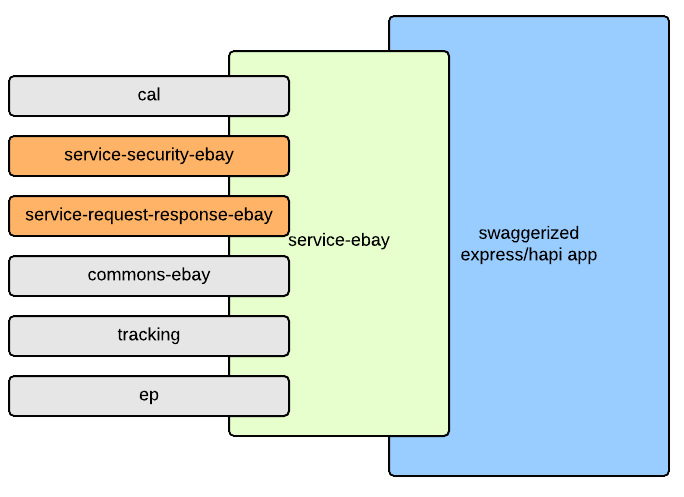

# service-security-ebay 
[](https://ebayci.qa.ebay.com/CI-Instance/job/service-security-ebay) [](https://nodevalid-i3ey5.vip.lvs01.dev.ebayc3.com/nodejs/service-security-ebay)  [](http://sonar/dashboard/index?id=service-security-ebay)

Service security layer for ebay nodejs services

It is based on [swagger 2.0 schema](http://swagger.io/) and follows [Commerce OS 2.0 standards](https://github.corp.ebay.com/commerceos/cos-secure-access).

# Installation

```
npm install service-security-ebay --save
```

# Usage

service-ebay already configures it in config.json as
```json
"api": {
    "security-providers": {
        "app_scope_auth": "require:service-security-ebay"
    }
}
```

You can access token attributes
```javascript
var tokenAttributes = req.security.getTokenAttributes();

console.log('scopes: ', tokenAttributes.attributes.scope);
console.log('domain: ', tokenAttributes.domain);
console.log('userId: ', tokenAttributes.userId);
console.log('accountId: ', tokenAttributes.accountId);
```

# Service configuration

The service configuration is based on [OpenAPI 3.0 schema](https://swagger.io/).
The route 'security' section should contain cos-oauth definitiona that lists scopes assigned to the given route.
If a route does not have security section, then it has unrestricted access.

The schema also defines all supported scopes in section 'securitySchemes'.

Example:
```yaml
openapi: 3.0.0
info:
  version: 1.0.0
  title: Swagger Petstore
  description: >-
    A sample API that uses a petstore as an example to demonstrate features in
    the OpenAPI 3.0 specification
  termsOfService: 'http://swagger.io/terms/'
  contact:
    name: Swagger API Team
    email: apiteam@swagger.io
    url: 'http://swagger.io'
  license:
    name: Apache 2.0
    url: 'https://www.apache.org/licenses/LICENSE-2.0.html'
servers:
  - url: 'http://petstore.swagger.io/api'
paths:
  /greetings:
    get:
      description: |
        Greets a customer
      parameters:
        - name: user
          in: query
          description: Name of the user
          required: true
          schema:
            type: string
      responses:
        '200':
          description: Successful response
      security:
        - app_scope_auth:
            - 'https://api.ebay.com/oauth/scope/buy@user'
            - 'https://api.ebay.com/oauth/scope/@public'
  /context:
    get:
      description: |
        Context testing
      parameters:
        - name: method
          in: query
          description: method to invoke in req.security
          required: true
          schema:
            type: string
      responses:
        '200':
          description: Successful response
      security:
        - app_scope_auth:
            - 'https://api.ebay.com/oauth/scope/buy@user'
  /nosecure:
    get:
      description: |
        No security
      parameters:
        - name: user
          in: query
          description: Name of the user
          required: true
          schema:
            type: string
      responses:
        '200':
          description: No security response
  /public:
    get:
      description: |
        No security
      parameters:
        - name: user
          in: query
          description: Name of the user
          required: true
          schema:
            type: string
      responses:
        '200':
          description: No security response
      security:
        - app_scope_auth:
            - 'https://api.ebay.com/oauth/scope/@public'
components:
  securitySchemes:
    app_scope_auth:
      type: oauth2
      description: >-
        The security definitions for this API. Please check individual
        operations for applicable scopes.
      flows:
        clientCredentials:
          tokenUrl: 'https://api.ebay.com/identity/v1/oauth2/token'
          scopes:
            'https://api.ebay.com/oauth/scope/@public': This scope would allow an application to access an operation.
            'https://api.ebay.com/oauth/scope/buy@user': This scope would allow an application to access an operation.
```

_Note_ that scopes contain shorter name as swagger does not allow url in the scope. The longer names will be produced by framework at runtime by adding 'https://api.ebay.com/oauth/scope/'.

The place of the module in nodejs service stack:

Where:
* Swagerrized [express](https://github.com/krakenjs/swaggerize-express)/[hapi](https://github.com/krakenjs/swaggerize-hapi) is application generated by [generator-swaggerize](https://www.npmjs.com/package/generator-swaggerize)
* service-ebay is a boostrap package that adapts express/hapi app to ebay nodejs service standard.
    * Enables a set of required modules specific to eBay nodejs service stack.
