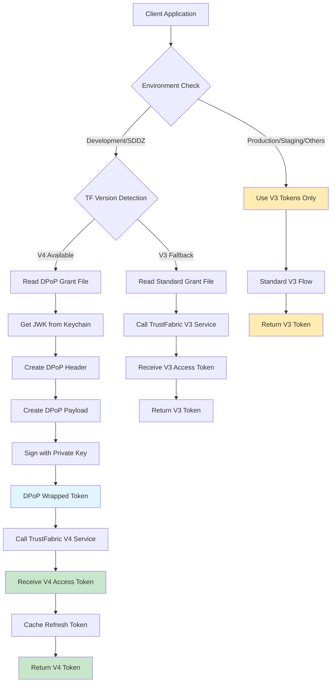
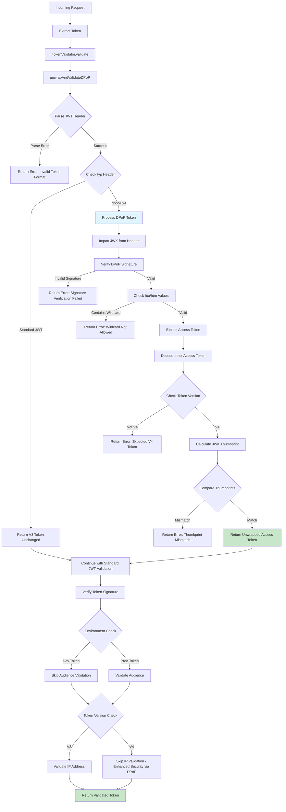

# Trust Fabric V4 Token Generation and Validation

## Overview

Trust Fabric V4 introduces **DPoP (Demonstration of Proof of Possession)** wrapped tokens that provide enhanced security over V3 tokens.

**Important**: V4 tokens are **only available in Development and SDDZ (Secure Development and Deployment Zone) environments**. All other environments (Production, Staging, etc.) continue to use V3 tokens.

This document explains the complete V4 token lifecycle including generation, wrapping, validation, and unwrapping processes.

## Table of Contents

- [V4 vs V3 Comparison](#v4-vs-v3-comparison)
- [Token Generation Flow](#token-generation-flow)
- [DPoP Token Structure](#dpop-token-structure)
- [Token Validation Flow](#token-validation-flow)
- [Security Features](#security-features)
- [Code Examples](#code-examples)
- [Setup and Configuration](#setup-and-configuration)

## V4 vs V3 Comparison

| Feature | V3 | V4 |
|---------|----|----|
| **Environment Support** | All environments | **Development and SDDZ only** |
| **Token Format** | Standard JWT | DPoP-wrapped JWT |
| **IP Validation** | Required | Skipped (enhanced security via DPoP) |
| **Key Binding** | None | JWK thumbprint binding |
| **Replay Protection** | Limited | Enhanced via DPoP proof |
| **Grant File** | Standard grant | Authorization code with DPoP |

## Token Generation Flow



### Detailed Generation Steps

#### 1. Environment Detection
```javascript
// TokenGenerator constructor
this.version = getTfVersion();  // Returns 'v3' or 'v4'

// V4/DPoP is only available in Development and SDDZ environments
this.useDPoP = this.version === 'v4' && (env.isDev() || env.isSDDZ());
```

#### 2. Grant File Reading
```javascript
// V3: Standard grant file
const grant = getGrantFromFile();

// V4: DPoP grant file with authorization code
const grant = getDPoPGrantFromFile();
// Reads from: ~/.appdata/.cloudsec/trustfabric/{appName}/authorization_code.json
```

#### 3. DPoP Token Creation (V4 Only)
```javascript
convertToDPoP(options, callback) {
    // Get JWK from keychain
    const jwk = getJwkFromKeychain();

    // Create DPoP payload
    const payload = {
        htu: 'https://trustfabric.vip.ebay.com/v4/token',
        htm: 'POST',
        iat: Math.floor(Date.now() / 1000),
        jti: crypto.randomUUID(),
        exp: Math.floor(Date.now() / 1000) + 600,
        code: options.token  // Grant token or refresh token
    };

    // Create DPoP header
    const header = {
        'alg': 'RS256',
        'typ': 'dpop+jwt',
        'jwk': jwk
    };

    // Sign and return DPoP token
    const dataToSign = `${base64url(header)}.${base64url(payload)}`;
    const signature = signWithKeychainPrivateKey(dataToSign);
    return `${dataToSign}.${signature}`;
}
```

## DPoP Token Structure

### V4 Access Token (Inner Token)
```json
{
  "header": {
    "alg": "RS256",
    "typ": "JWT",
    "kid": "key-id",
    "x5u": "https://trustfabric.vip.ebay.com/v4/k/key-id"
  },
  "payload": {
    "iss": "trustfabric",
    "aud": ["fidelius", "patronus"],
    "sub": "cn=app-name,ou=app,dc=ebay,dc=com",
    "ver": "4",
    "cnf": {
      "jkt": "thumbprint_of_client_jwk"
    },
    "exp": 1640995200,
    "iat": 1640908800,
    "nbf": 1640908800
  }
}
```

### DPoP Wrapper Token (Outer Token)
```json
{
  "header": {
    "alg": "RS256",
    "typ": "dpop+jwt",
    "jwk": {
      "kty": "RSA",
      "n": "...",
      "e": "AQAB",
      "kid": "client-key-id"
    }
  },
  "payload": {
    "htm": "POST",
    "htu": "https://api.ebay.com/service",
    "iat": 1640908800,
    "jti": "random-uuid",
    "accesstoken": "eyJ...inner_v4_token...abc"
  }
}
```

## Token Validation Flow



### Key Validation Steps

#### 1. DPoP Header Validation
```javascript
const dpopHeader = jose.decodeProtectedHeader(token);

// Validate JWT format
if (!dpopHeader) {
    throw new Error('Invalid JWT token - header is missing');
}

// Check if token is DPoP wrapped
if (!dpopHeader.typ?.includes('dpop+jwt')) {
    return token; // Return V3 token unchanged
}
```

#### 2. Signature Verification
```javascript
// Import public key from header
const publicKey = await jose.importJWK(dpopHeader.jwk, dpopHeader.alg);

// Verify DPoP signature
const { payload } = await jose.jwtVerify(token, publicKey);
```

#### 3. Security Validations
```javascript
// Prevent wildcard attacks
if (dpopPayload.htu === '*' || dpopPayload.htm === '*') {
    throw new Error('htu and htm are not allowed to be *');
}

// Validate V4 token
const accessTokenPayload = jose.decodeJwt(dpopPayload.accesstoken);
if (accessTokenPayload.ver !== '4') {
    throw new Error('access token is not a V4 token');
}

// Validate JWK binding
const cnfJkt = accessTokenPayload.cnf.jkt;
const thumbprint = await jose.calculateJwkThumbprint(dpopHeader.jwk);
if (thumbprint !== cnfJkt) {
    throw new Error('cnf.jkt does not match thumbprint');
}
```

## Security Features

### 1. JWK Thumbprint Binding
- Access token contains `cnf.jkt` claim with JWK thumbprint
- DPoP token header contains the actual JWK
- Validation ensures they match, preventing token theft

### 2. Replay Protection
- Each DPoP token contains unique `jti` (JWT ID)
- Time-bound with `iat` and `exp` claims
- Request-specific with `htm` and `htu` claims

### 3. Enhanced IP Security
- V4 tokens skip traditional IP validation
- Security provided by cryptographic proof of possession
- More flexible for cloud and distributed environments

### 4. Wildcard Protection
- Prevents `*` values in `htm` and `htu` fields
- Ensures tokens are bound to specific HTTP methods and URLs

## Code Examples

### Token Generation
```javascript
const TokenGenerator = require('./lib/TokenGenerator');

// Create TokenGenerator instance
const generator = new TokenGenerator({
    version: 'v4',
    scopes: ['read', 'write'],
    htm: 'POST',
    htu: 'https://api.ebay.com/service'
});

// Generate token
generator.getToken((err, token) => {
    if (err) {
        console.error('Token generation failed:', err);
        return;
    }
    console.log('Generated V4 token:', token);
});
```

### Token Validation
```javascript
const TokenValidator = require('./lib/TokenValidator');

const req = {
    headers: {
        'authorization': `Bearer ${token}`,
        'x-ebay-client-ip': clientIP
    }
};

const validator = new TokenValidator(req);

validator.validate(token, (err, decoded) => {
    if (err) {
        console.error('Token validation failed:', err);
        return res.status(401).json({ error: 'Invalid token' });
    }

    console.log('Token validated successfully:', decoded.payload);
    // Token is valid, proceed with request
});
```

### Direct DPoP Unwrapping
```javascript
const validator = new TokenValidator(req);

try {
    const accessToken = await validator.unwrapAndValidateDPoP(dpopToken);
    console.log('Unwrapped access token:', accessToken);
} catch (error) {
    console.error('DPoP validation failed:', error);
}
```

## Setup and Configuration

### Environment Requirements

**V4 tokens are only supported in:**
- ✅ **Development** environments (`NODE_ENV=development`)
- ✅ **SDDZ** (Secure Development and Deployment Zone) environments

**V3 tokens are used in:**
- 🔶 **Production** environments
- 🔶 **Staging** environments
- 🔶 **Pre-production** environments
- 🔶 All other non-development environments

### Prerequisites for V4 (Development/SDDZ)
1. **DevOps Role**: Required for SDDZ applications
2. **CloudSec CLI**: Download and configure in PATH
3. **Machine Registration**: Register with IDM for TrustFabric tokens
4. **Keychain Access**: Properly configured for JWK storage

### Environment Setup

#### For SDDZ (V4 Supported)
```bash
# Set cluster type for SDDZ
export TESS_CLUSTER_TYPE=sddz

# Authenticate and generate V4 grant
cloudsec auth login
cloudsec codegrant exchange -a <application_name>

# Start application (will auto-detect V4)
npm run dev
```

#### For Development (V4 Supported)
```bash
# Set development environment
export NODE_ENV=development

# V4 tokens will be auto-detected and used
npm run dev
```

#### For Production (V3 Only)
```bash
# Production automatically uses V3 tokens
export NODE_ENV=production

# Standard V3 flow - no special setup needed
npm start
```

### Configuration Options
```javascript
// Token generation options (auto-detects V3/V4 based on environment)
const options = {
    // version: 'v4',       // Don't force - let library auto-detect
    scopes: ['read'],       // OAuth scopes
    htm: 'POST',            // HTTP method (V4 only)
    htu: 'https://...'      // Target URL (V4 only)
};

// Environment-based behavior:
// - Development/SDDZ: Uses V4 if available, falls back to V3
// - Production/Staging: Always uses V3
```

### File Locations

#### Development/SDDZ Environments (V4 Supported)
- **V4 Grant**: `~/.appdata/.cloudsec/trustfabric/{app}/authorization_code.json`
- **V3 Grant** (fallback): `~/.ebay/trustfabric/{app}/grant`
- **JWK Keychain**: System keychain (macOS) or equivalent

#### Production/Staging Environments (V3 Only)
- **V3 Grant**: `~/.ebay/trustfabric/{app}/grant`
- **No DPoP**: JWK keychain not required

## Testing

### Unit Tests
The project includes comprehensive tests for DPoP functionality:

```bash
# Run all tests
npm test

# Run DPoP-specific tests
./node_modules/.bin/mocha test/TokenValidator-test.js --grep "DPoP"
```

### Test Coverage
- ✅ Valid DPoP token generation and validation
- ✅ V3 token pass-through compatibility
- ✅ Security validation (wildcards, signatures, thumbprints)
- ✅ Error handling for malformed tokens
- ✅ IP validation bypass for V4 tokens

## Troubleshooting

### Environment-Related Issues

#### ⚠️ **V4 Not Available in Production**
```
Error: V4 tokens are not supported in this environment
```
**Solution**: This is expected behavior. V4 tokens are **only available in Development and SDDZ environments**. Production, staging, and other environments automatically use V3 tokens.

#### **Environment Detection Issues**
```
Error: Unexpected token version in environment
```
**Solution**:
- Verify `NODE_ENV` is set correctly
- For SDDZ: Ensure `TESS_CLUSTER_TYPE=sddz` is set
- For Production: Remove any V4-specific configurations

### Common Issues

1. **Grant File Not Found**
   ```
   Error: DPOP Grant file not found at ~/.appdata/.cloudsec/...
   ```
   **Solution**: Run `cloudsec codegrant exchange -a <app_name>`

2. **JWK Keychain Access**
   ```
   Error: Failed to get JWK from keychain
   ```
   **Solution**: Ensure keychain access is properly configured

3. **Version Mismatch**
   ```
   Error: access token is not a V4 token
   ```
   **Solution**: Verify TrustFabric service returns V4 tokens

4. **Thumbprint Mismatch**
   ```
   Error: cnf.jkt does not match the thumbprint of the jwk
   ```
   **Solution**: Ensure JWK consistency between token generation and validation

## Best Practices

1. **Environment Detection**: Let the library auto-detect V4 vs V3 based on environment
2. **Error Handling**: Always handle token generation and validation errors gracefully
3. **Caching**: Leverage built-in token caching for performance
4. **Security**: Never log or expose full token values
5. **Testing**: Use provided test utilities for comprehensive coverage

## Migration from V3

V4 tokens are designed to be backward compatible with **automatic environment-based selection**:

### Environment-Based Automatic Selection
- **Development/SDDZ**: Library automatically attempts V4, falls back to V3 if needed
- **Production/Staging**: Library automatically uses V3 tokens only
- **No code changes required**: The library handles environment detection

### Migration Benefits
- ✅ **Zero Code Changes**: Existing applications automatically benefit
- ✅ **Automatic Fallback**: V3 continues to work in all environments
- ✅ **Enhanced Security**: V4 provides better security where available
- ✅ **Transparent Operation**: DPoP wrapping/unwrapping is automatic

### Key Points
1. **No Production Impact**: V4 is never used in production environments
2. **Development Benefits**: Enhanced security and testing capabilities in dev/SDDZ
3. **Gradual Adoption**: Teams can test V4 in development without affecting production
4. **Backward Compatibility**: All existing V3 integrations continue to work unchanged

The library intelligently handles environment detection and token version selection, providing the security benefits of V4 where appropriate while maintaining V3 compatibility everywhere else.